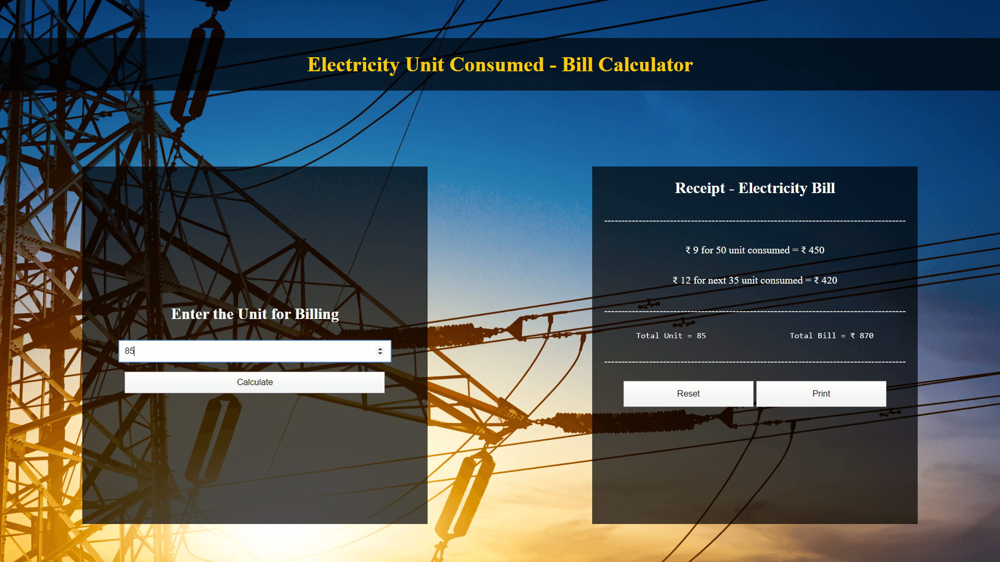
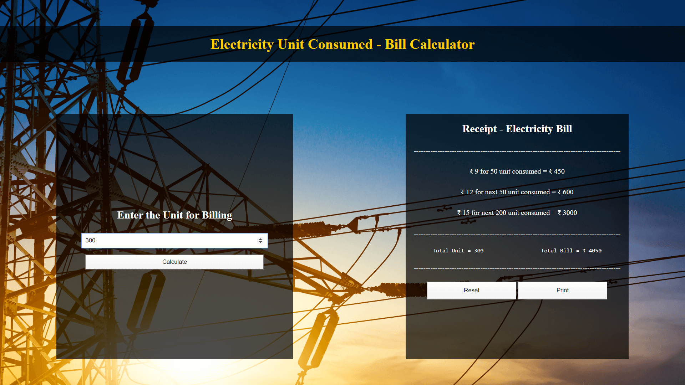

# Electricity Unit Bill Calculator
This is a website where a user can input the unit consumed and the system will generate the receipt for it, which he can print on the spot.

# Home Page - Section 1 - User's Input for Unit Consumed

# Home Page - Section 2 - Receipt Section

# Atempt 1: Unit Consumed = 49 : Result = Bill Generated of ₹ 441/-

## Print Option for Bill Generated by Atempt 1

# Atempt 2: Unit Consumed = 85 : Result = Bill Generated of ₹ 870/-

## Print Option for Bill Generated by Atempt 2

# Atempt 3: Unit Consumed = 300 : Result = Bill Generated of ₹ 4,050/-

## Print Option for Bill Generated by Atempt 3

# Reset Button Use: Reset the complete page.

### Benefits of this website
1. Generation of Receipt according to electricity unit consumed.
2. Once Generated the bill, user can print it with the print option avilable.
3. If user wish to re enter the data he can use reset button to reset all the content.
